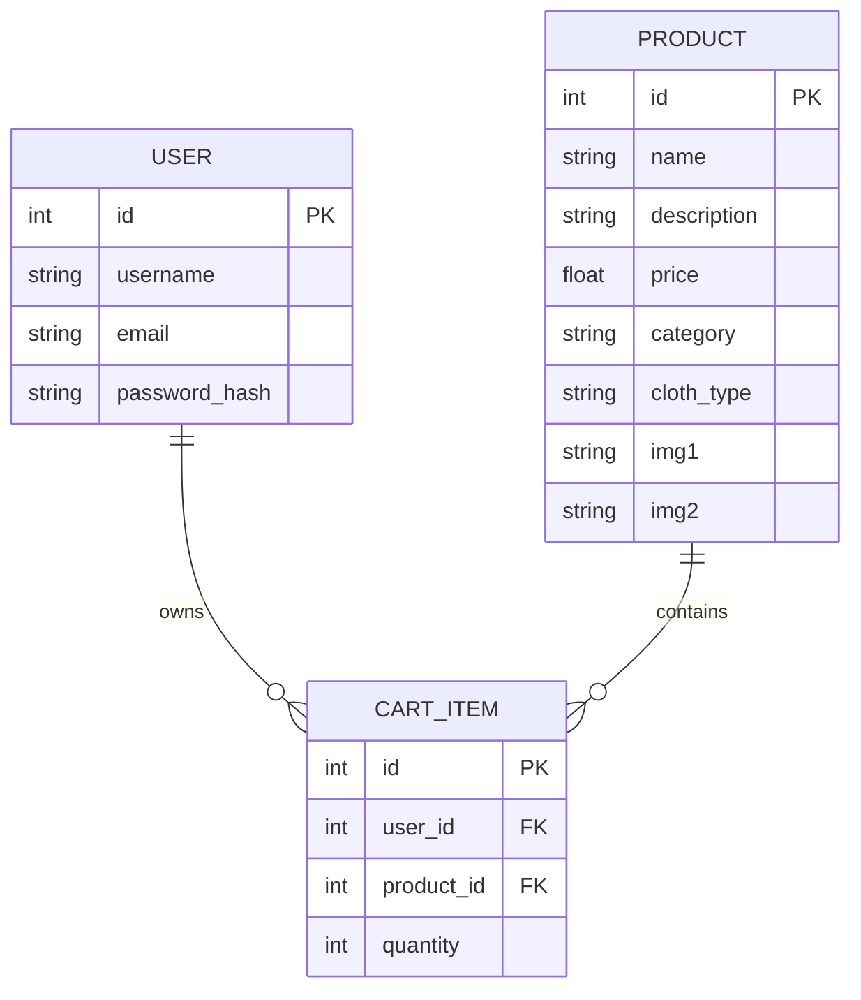

# Database Schema

Mackkas uses an SQLite database (`mackkas.db`) managed via SQLAlchemy ORM.

## Entity Relationship Diagram

## Table Definitions

### 1. `user`
| Column | Type | Constraints |
|---|---|---|
| `id` | `Integer` | `Primary Key` |
| `username` | `String(80)` | `Unique`, `Not Null` |
| `email` | `String(120)` | `Unique`, `Not Null` |
| `password_hash` | `String(128)` | `Not Null` |

### 2. `product`
| Column | Type | Constraints |
|---|---|---|
| `id` | `Integer` | `Primary Key` |
| `name` | `String(100)` | `Not Null` |
| `description` | `String(200)` | |
| `price` | `Float` | `Not Null` |
| `category` | `String(50)` | |
| `cloth_type` | `String(50)` | |
| `img1` | `String(200)` | |
| `img2` | `String(200)` | |

### 3. `cart_item`
| Column | Type | Constraints |
|---|---|---|
| `id` | `Integer` | `Primary Key` |
| `user_id` | `Integer` | `Foreign Key (user.id)` |
| `product_id` | `Integer` | `Foreign Key (product.id)` |
| `quantity` | `Integer` | `Default: 1` |
